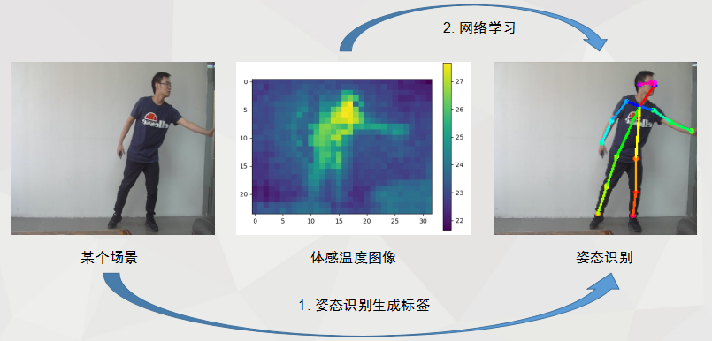
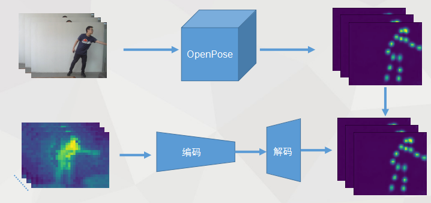
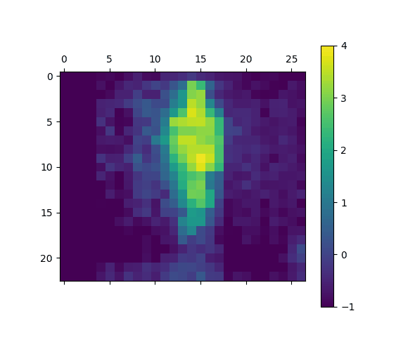
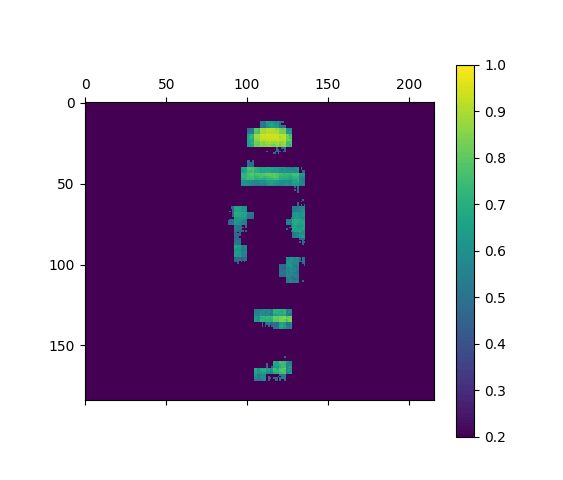
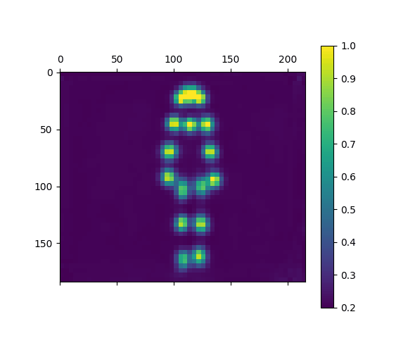

# Simple-Infrared-thermography-pose-prediction

- 为方便理解，代码保持尽可能的简单易读，总代码量保持在200行左右。
- 数据集在`train_data`目录下，这里只有用于演示的简单样本。
- `time_align.py`脚本用于对齐红外阵列传感器与相机的时间，使得模型输入与输出的时间标签匹配。这里已经生成了`data_name_idx.txt`文件。
- `heatMat`目录为相机图像生成的关键点热力图，作为红外热成像图对应的标签(Label)以及模型的预测值(Prediction)。关键点热力图也可以使用其他开源库生成实现。

    
    

- 运行`python train.py`，训练模型。(这里需要完整的数据集)
- 运行`python eval.py`,评估模型。

    )  
